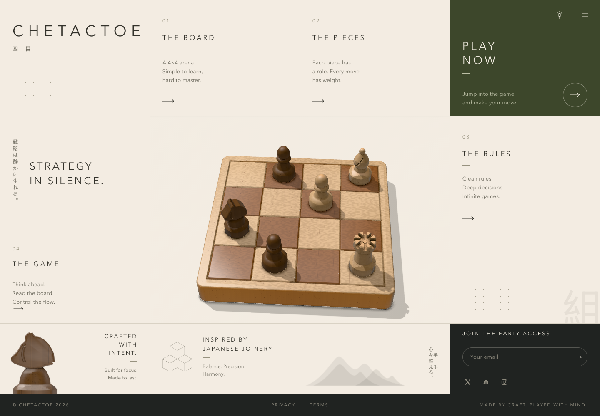
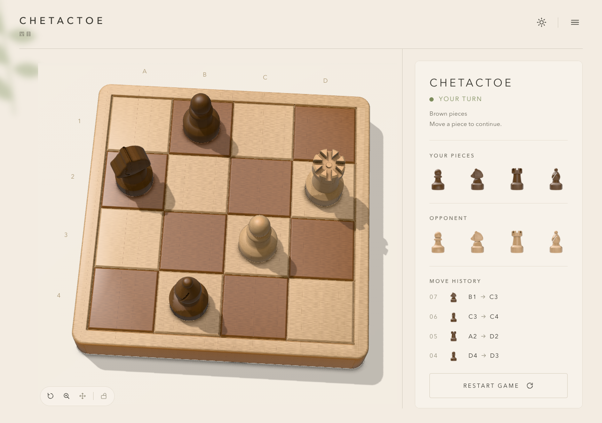
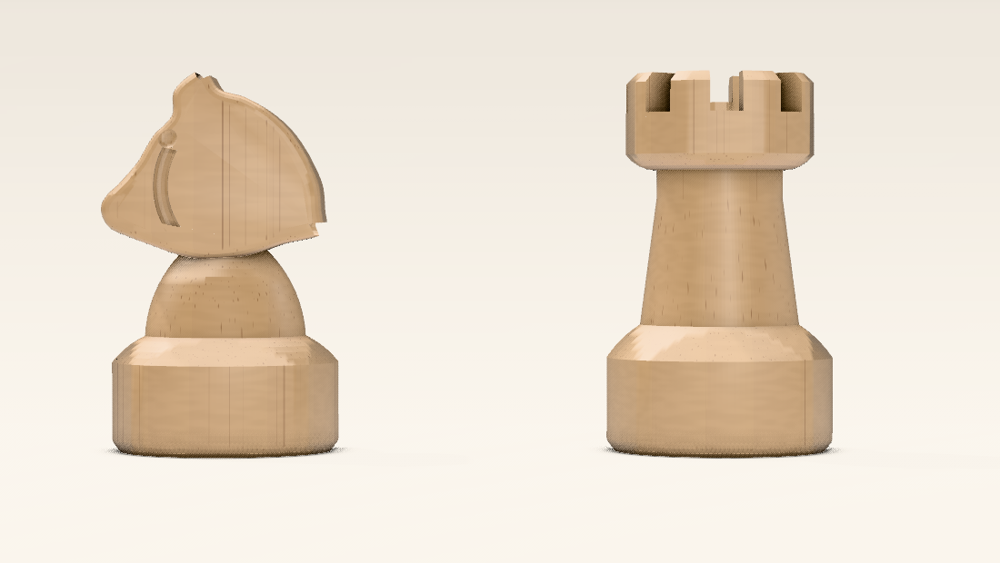

# Chetactoe

A 4×4 chess board and a set of turned wooden pieces, rendered in the browser with
WebGPU. Every piece is real geometry cut on a virtual lathe, and every surface is
procedurally shaded oak — no textures, no imported models, nothing baked.

This is the web client for [`mayhsc/chetactoe`](https://github.com/mayhsc/chetactoe).



## Quick start

```bash
npm install
npm run dev          # http://localhost:5178
```

**WebGPU is required.** `WoodNodeMaterial` builds its pore structure from a
`TSL.wgslFn`, so there is no WebGL fallback — the page shows an explanatory message
instead. Chrome/Edge 113+ or Safari 26+.

## The board



Pieces on `/play.html` are **draggable** — pick any one up and drop it on any empty
square. The camera's rotate / zoom / pan axes each have a toggle plus a master lock,
in the cluster at the board's bottom-left.



## Pages

| page | what |
| --- | --- |
| `/` | the landing page: a 4×4 grid whose central 2×2 is the live board |
| `/play.html` | the game shell: board, coordinate labels, side panel, piece tray, light/dark |
| `/board.html` | the board framed exactly like the reference photograph, for verification |
| `/pieces.html` | the four pieces in a row, framed like their reference |
| `/compare.html` | fade / wipe / difference the board render against its reference |

`/` and `/play.html` take `?theme=dark`; `/board.html` takes `?pieces=0`; `/pieces.html`
takes `?tone=dark`, `?piece=knight` and `?bg=none`. Every page accepts camera overrides
— `?fov=` `?elev=` `?az=` `?dist=` `?y=` — and `?w=`/`?h=` to pin the canvas size for
capture. Drag to orbit on every page but `/`, where the camera answers the pointer
instead; `p` saves a PNG. `/board.html` and `/pieces.html` carry the tuning GUI
(`?gui=0` hides it).

### The reference photographs

The renders were matched numerically against two source photographs, which are **not
in this repo** — `reference/` is gitignored. `/compare.html`, `tools/analyse.mjs` and
`tools/fit-camera.mjs` need them; everything else runs without. To use those, drop
`target.png`, `pieces.png` and `pawn-on-board.png` into `reference/`.

## How it is put together

| file | role |
| --- | --- |
| `src/board.js` | slab + groove geometry, carved with `three-bvh-csg` |
| `src/lathe.js` | profile builder and surface-of-revolution generator |
| `src/pieces/profiles.js` | the four turned profiles, authored from measurements |
| `src/pieces/knight.js` | the sculpted head: outline, erosion, eye and jaw carving |
| `src/pieces/index.js` | `createPiece()` — lathe plus per-piece CSG features |
| `src/wood.js` | `WoodNodeMaterial` setup, plus end-grain and ray-fleck layers |
| `src/studio.js` | the lighting rig, PMREM'd into an environment map |
| `src/stage.js` | renderer, camera, cyclorama and GTAO — shared by both pages |
| `src/scene.js` | board + pieces assembly and the square/cell mapping |
| `src/interaction.js` | pointer drag: pick, carry, cell marker, snap |
| `src/viewcontrols.js` | rotate / zoom / pan toggles and the view lock |
| `src/home.js` + `src/home.css` | the landing page |
| `src/app.js` + `src/app.css` | the game shell |
| `src/main.js` | the reference-framed board page |
| `src/pieces-view.js` | the pieces page |

### The landing page

The page *is* the board: a 4×4 CSS grid, with the real Three.js board in the central
2×2 and the twelve surrounding cells carrying the copy. Four things in it are worth
knowing about.

- **The grid lines are one overlay, drawn segment by segment.** `.lines` is a second
  grid with the same template, absolutely positioned over the first, holding ten 1px
  borders placed by `grid-column` / `grid-row`. Two of those segments — the ones that
  cross the wood — are a translucent white instead of the page's beige, so the line
  reads as etched into the board rather than drawn on top of it. Placing them by grid
  rather than by percentage means the overlay cannot drift from the cells: the row
  heights are not equal, and `tools/check-home.mjs` asserts the two agree.

- **Two layouts, and the difference is whether the page has a definite height.** Given
  ≥1101×760 the page locks to the viewport and the rows become fractions of it — the
  design proper, one board and one screen, no scrolling. Below that the rows size to
  their content, the page scrolls, and each cell carries its own hairline edge. `fr`
  rows need a definite height to divide anything; on a `min-height` page they size to
  content instead and the tallest cell drags the whole grid past the fold.

- **The type scales off whichever axis is tighter**, `--u: min(1vw, 1.42vh)`. A poster
  that fills the viewport cannot scale off width alone: on a short, wide screen every
  cell keeps its full-size type and the rows run out of room — and because the layout
  does not scroll, copy that does not fit is not pushed down, it is cut off. At the
  design's 1536×1024 both terms land near 14.5px, the size it was measured at.

- **The board is the page's picture, not its instrument.** Orbit is off; instead the
  camera leans a few degrees toward the pointer and eases back, a hovered piece rises
  3.5 mm off the board, and clicking anywhere on it goes to the playground. The camera
  distance is re-solved on every resize so the board keeps the same framing whatever
  shape its two-by-two cell happens to be.

The four numbered sections and the menu open one dialog whose content is swapped, not
five panels. The piece in the craft cell is the real model, rendered by
`tools/make-icons.sh` at four times icon size.

### The shell

`play.html` is a static grid — topbar, stage, panel — around a canvas that the 3D
mounts into. Three parts are worth knowing about:

- **The coordinate labels are projected, not positioned.** Each rank and file label is
  parked just outside the board's edge *in board space* and its screen position
  recomputed every frame from the camera, so they follow the perspective exactly and
  keep following it while you orbit. Placing them in CSS would mean re-deriving the
  projection by hand and redoing it on every camera change.
- **The page background is matched to the rendered backdrop, not to its input colour.**
  The canvas goes through tone mapping and the page does not, so `#f2ede5` in the scene
  arrives as `#f3ece2` on screen; left unmatched, the canvas shows as a faint rectangle
  against the page. Both palettes are pinned to the measured value.

- **The theme is applied by a blocking script in `<head>`, before the stylesheet.**
  The CSS default palette is the light one, so setting it from a module — even at
  import time — still starts from light and animates across. That flashes on load,
  and in a headless capture it freezes the page halfway between the two palettes
  while the canvas and card are already dark. Painting the right palette first is the
  only version that holds.

Piece icons in the panel and tray are pre-rendered from the real models on a
transparent background by `tools/make-icons.sh`, into `public/icons/`. Eight small
PNGs beat eight live WebGPU contexts, and they stay in step with the geometry because
they come out of it. The same script renders the landing page's craft photograph —
`craft-knight.png`, the same camera at four times the area, because that one is shown
the height of a whole grid cell rather than 46px tall.

### Moving pieces

Free movement, deliberately: nothing checks whose turn it is or whether a knight moves
in an L. The one rule is that **dropping on an occupied square is refused** and the
piece settles back where it came from — with no reserve for a captured piece to go to,
a capture would mean silently deleting a piece from the set, which is worse than
declining the move. Off-board drops are refused the same way.

`squareAt()` in `src/scene.js` is the inverse of `cellCentre()` and returns `null`
outside the playing field, which is what makes both refusals fall out of one check.

While a piece is being carried, the camera is frozen and then **restored to whatever it
was**, not to all-on — the view toggles may have had an axis switched off, and a drag
must not quietly re-enable it.

### The view lock

Three axes, three toggles, one lock. The lock is not "turn everything off": it
remembers the combination it was locked over and restores exactly that, so unlocking
never hands back an axis the user had switched off.

Two things `OrbitControls` does not do that had to be added: panning is set to track the
ground rather than the screen (`screenSpacePanning = false`), because a board on a table
sliding out of its own plane reads as a glitch; and the target is clamped to a small box
around the origin on every `change`, because there are distance limits but no target
limits, so pan otherwise walks the board out of frame with no way back but Restart.

### Placing pieces

`createPiece(type, material)` returns a mesh whose **origin is the centre of the base's
underside**, and the board's top face is `y = 0`, so placing one is just a position:

```js
import { createPiece } from './pieces/index.js';
import { cellCentre } from './main.js';

const [ x, z ] = cellCentre( col, row );   // 0-indexed from the far-left cell
scene.add( Object.assign( createPiece( 'knight', material ), { position: … } ) );
```

Pieces are 43.1–45.3 mm tall on a 26.5 mm base — 59% of the board's 44.69 mm cell.
Geometry is cached per type, so a full set costs four CSG builds.

**Board geometry.** The slab is an `ExtrudeGeometry` of a rounded square with a bevel on
both rims, and the ten grid lines are 90° V-cutters subtracted with CSG. Each cutter's
profile carries a small fillet where it meets the surface — that soft bright line
along one side of every groove is most of what makes the board read as a sanded solid
rather than a texture. `toCreasedNormals` at 30° then smooths the rim fillets and
groove lips while keeping the square edges and V bottoms crisp. Result is ~16k
triangles, built in ~300 ms at startup.

Because the material samples its wood field from `positionLocal` in 3D, the grain
flows correctly through the carved grooves for free — the fine cross-marks where grain
meets a groove wall in the reference come out of the geometry, not a texture.

**Piece geometry.** Pawn, rook and bishop are pure turning, so the reference
silhouette *is* the lathe profile and could be read straight off the photograph.
`src/lathe.js` revolves those profiles itself rather than using `THREE.LatheGeometry`,
which averages the normals of adjacent profile segments and so cannot keep a
deliberately crisp shoulder crisp. The rook's eight crenellations and central recess,
and the bishop's mitre slit, are cut with the same CSG pass the board's grooves use.

The knight is built the way a real one is — its side profile milled from a flat blank
and the edges rounded over — so it is an extruded outline with a bevel, unioned onto
the turned stem, then carved with an eye and a jaw line.

**Lighting.** A small scene of emissive panels is run through `PMREMGenerator` for the
environment, with one directional light for the cast shadow and the left-to-right
falloff. A GTAO pass supplies the occlusion that image-based lighting cannot: without
it the V-grooves stay nearly as bright as the surface they are cut into, where the
reference's groove cores sit ~100 luminance below the field.

## Matching it, measured rather than eyeballed

Everything about the framing was solved numerically, because eyeballing it was wrong
by a lot. `tools/fit-camera.mjs` fits the camera and the border margin against sixteen
features measured off the reference — six silhouette anchors plus the ten grid grooves
— and lands at **3.9 px RMS over a 1353 px frame**, with the grooves inside 3 px.

The fit says the photo is a **19.6° lens from 62.4° elevation**. By eye it looks like
roughly a 40° view; that guess put the board visibly wrong and no amount of tweaking
fixed it. The grid grooves matter as constraints because the silhouette alone leaves
the perspective *distribution* slack: a wrong fov/distance pair can put the far and
near edges in exactly the right place and still misplace everything between them.

Tone was matched the same way, against fixed sample points (`tools/tones.mjs`). Three
things that came out of measuring rather than looking:

- **The lighting is overhead-dominant with the key behind-left.** The reference's front
  face sits ~86 luminance below its top face, and the cast shadow runs forward-right.
- **The albedo is far more saturated than the top face looks.** That face reads
  desaturated only because it is brightly lit *and* carries the broad neutral sheen of
  the softbox in the finish — the shaded front face shows the real colour. Matching the
  top face directly gives a board that turns grey the moment anything shades it.
- **The grain is much subtler than it appears.** Inside a single cell the reference
  spans **9 luminance levels** (sd 1.8). Any normally-contrasted wood colour pair
  renders as corduroy at this scale.

## Where `WoodNodeMaterial` needed help

Three things had to be added or worked around. All are documented at the point of use.

1. **Its distance heuristics assume a scene a few units across.** `wood()` divides
   `cellSize` by `max(|positionView| * 10, 1)` and clamps a ring-blur term at 1. On a
   0.2 m board 0.59 m from the camera the pore threshold collapses and clamps flat, and
   ring contrast is capped at 0.58–0.92 of the colour mix no matter what. Both have to
   be compensated in the parameters.
2. **Warp strengths are absolute distances in wood space.** Chasing a fine ring spacing
   by shrinking `ringThickness` pushes the ring period below the warp amplitude and the
   warps shred the rings into noise. The fix is the opposite: keep the preset's ring
   period and enlarge the board in wood space via `GRAIN.scale`, moving `GRAIN.offset`
   out with it so the rings still read as straight quartersawn lines.
3. **It has no notion of fibre direction.** Two layers are added on top of its
   `colorNode`: an **end-grain tint**, because the reference's front face is darker than
   the top face yet carries *more* chroma, which one albedo cannot do; and **medullary
   ray fleck**, the short cross-grain dashes that are the signature of quartersawn oak
   and, magnified, the dominant texture on the reference's face. Without the fleck layer
   the board reads as smooth vertical streaking however the ring parameters are set.

   Both layers are also why `grainMatrix` takes an axis. A board is a plank with its
   fibres along +Z; a turned piece comes off the lathe with them running up its own
   axis, which is what makes the top of a pawn's head read as end grain and lays the
   rings down the piece as vertical stripes instead of concentric bullseyes. Both
   layers need retuning too — the board's end-grain tint flares every horizontal
   surface of a turned piece into a salmon band, and the pieces are a pale close-grained
   timber with almost no visible fleck.

4. **It is not a `NodeMaterial`, and that silently breaks per-object shading.**
   `WoodNodeMaterial` extends `MeshPhysicalMaterial` from the WebGL entry point, so
   `isNodeMaterial` is false on it. That matters because `RenderObject.getMaterialCacheKey`
   — which decides when two objects can share a compiled shader — starts from
   `material.customProgramCacheKey()`, and only `NodeMaterial` overrides that to hash
   its node graph. A plain material returns `''`, and every remaining object-valued
   property, `colorNode` included, collapses to the literal `'{}'`.

   So the board and all six pieces hashed to one key and shared a single program, built
   from whichever material the renderer reached first; every per-material graph after
   that was compiled and then discarded. The failure is completely silent — no error,
   no warning, and `renderer.debug.getShaderAsync` reports the *correct* shader, because
   it builds one fresh on demand rather than returning the one being drawn with. The fix
   is `toNodeMaterial()` in `src/wood.js`: re-home the material on
   `MeshPhysicalNodeMaterial` so the cache key hashes the graph. The wood uniforms all
   read their values off the material by name at draw time via `onObjectUpdate`, so
   copying the properties across carries the preset over intact.

Also worth knowing: `WoodNodeMaterial` builds its `colorNode` once at module scope and
bakes in the *teak/raw* `clearcoatDarken`, so the finish preset's darkening never
applies to any material. Per-material parameters do work — they are wired through
`onObjectUpdate` — but that one multiplier is fixed.

## Matching the pieces

Same method. `tools/profile.mjs` pulls radius-against-height out of the photograph;
`tools/check-profiles.mjs` compares the authored lathe profiles against it;
`tools/fit-pieces.mjs` solves the camera and the row spacing.

Two measurement traps worth knowing about, both handled in `tools/profile.mjs`:

- **The contact shadow reads as part of the piece.** It falls to the right of every
  one, which both inflates the right edge and drags the apparent turning axis across
  with it — enough to throw the extracted radii out by 20%. So the axis comes from the
  median mid-point of the upper body, where the shadow never reaches, and the radius is
  measured from the **left edge only** and mirrored.
- **Rows below the base's widest point are not profile.** The camera looks very
  slightly down onto the base, so those rows trace its bottom ellipse. They are excluded
  and the underside is modelled as a flat face instead.

Results: the four authored profiles sit **0.22–0.59 mm RMS** against the measured ones
(under a reference pixel for the rook and bishop), and the camera fit lands at
**1.2 px RMS over twelve constraints**. Rendered against the reference, heights come
within 2 px, turning axes within 3 px, and the light wood's mean colour within about a
luminance level on the pawn.

Some things the measurements settled that guesswork would not have:

- **The set is nearly uniform.** All four pieces are within 5% of each other in height
  and share one base diameter — a chunky café pattern, not a graduated tournament set.
- **The rook has eight crenellations.** Merlon centres measure at −44°, 0° and +43°
  across a 40 px crown, which is a 45° pitch.
- **Two heads are ellipsoids, not spheres.** No circle through the pawn's measured
  equator also reaches its apex; it is prolate by about 12%. Same for the bishop's finial.
- **The pieces' camera is nearly level** — a 9.8° lens about 4° above the table, against
  the board's 62°.

## Known differences from the reference

Honest list, all measured:

- **Left side ~+18 luminance.** The left rim, and the left column of the face by ~+10.
  The reference falls off from its far-left toward its near-left, which needs a
  finite-distance source; the PMREM environment is directional-only, so it cannot
  produce spatial falloff. A spot or area light would fix it at the cost of retuning.
- **The contact shadow is neutral, the reference's is warm** (chroma 40 vs 12). That
  warmth is light bounced off the board into its own shadow — one interreflection, which
  neither IBL nor direct lighting reproduces. It would need real GI or a faked bounce.
- **Ray fleck is softer and lower-contrast than the reference's.** Close, in character,
  not identical; the reference's flecks have crisper edges.
- **Front face ~11 luminance dark and less saturated** than the reference's end grain.
- The backdrop is evenly lit; the reference has a slight gradient across it.

Everything else lands within about ±6 luminance across the face, with the cast shadow
and the within-cell grain statistics matching closely.

On the pieces:

- **The knight reads flatter than the reference's.** Its silhouette matches and it has
  a carved eye and jaw line, but the reference head is fully sculpted in three
  dimensions — the muzzle is narrower than the skull — while this one is a constant
  thickness slab with a rounded-over edge. Closing that gap means lofting the outline
  through a varying thickness rather than extruding it, which is a real piece of work
  rather than a parameter change.
- **The base diameter is a compromise at 26.5 mm.** Comparing rendered silhouettes
  argues for 26.9 and comparing authored profiles against the reference's ratios argues
  for 26.0; the two masks disagree because the photograph is slightly soft-focused and
  the render is not.
- **The dark set is invented.** There is no dark reference, so it is a stain over the
  same timber, tuned by eye rather than measured.
- The reference's own rook and bishop are 5–10 luminance darker than its pawn; these
  four are uniform, so the bishop runs bright by about that much.
- The cyclorama's floor sits ~13 luminance above its wall where the reference is even.

On the shell:

- **The board renders warmer than the design comps.** Its colour is matched to
  `reference/target.png`, the photograph given first; both comps show a paler, more
  neutral beech. The measured match won by default — it is a one-line change in
  `WOOD` if the comp should win instead.
- **The board carries slightly more rotation than the comp**, which is very nearly
  square-on. Camera framing is otherwise matched: the board lands within a few pixels
  of the comp's, at 758×702 against 756×694.
- **No game rules.** Pieces move freely; nothing validates a move beyond refusing an
  occupied or off-board square, and the turn indicator just flips to whoever did not
  just move. The opening position is sample data in `STATE` at the top of `src/app.js`,
  and Restart puts every piece back on it.
- The hamburger opens nothing yet.

## Tools

Dev-only, all plain Node with no dependencies (`tools/png.mjs` is a small PNG
reader/writer built on `node:zlib`).

```bash
node tools/check-squares.mjs                     # square <-> position round-trip
node tools/check-interaction.mjs                 # drag + view lock, in a real browser
node tools/check-home.mjs                        # landing page: grid, clipping, sheet, theme
node tools/fit-camera.mjs                        # board camera + margin from the reference
node tools/fit-pieces.mjs [elevation]            # pieces camera + row spacing
node tools/profile.mjs reference/pieces.png      # radius-vs-height for all four pieces
node tools/profile.mjs reference/pieces.png knight outline
node tools/check-profiles.mjs [piece]            # authored profiles vs measured
node tools/grid.mjs reference/target.png a.png   # locate the ten grid grooves
node tools/tones.mjs reference/target.png a.png  # tone comparison at fixed points
node tools/cellprofile.mjs ref.png a.png         # grain character inside one cell
node tools/analyse.mjs a.png                     # silhouette + tone summary
node tools/crop.mjs out.png 430 330 260 190 3 reference/target.png a.png
tools/shot.sh latest.png                         # headless board capture, 1353x1162
tools/shot-pieces.sh pieces.png                  # headless pieces capture, 750x230
tools/shot-home.sh home.png ["?theme=dark"]      # landing page, 1536x1024
node tools/shot-page.mjs out.png 430x932 [path]  # full page at a real device viewport
```

Use `shot-page.mjs` rather than `shot-home.sh` for the narrow layouts: `shot-home.sh`
sizes the window to the shot, and since the page scales off the viewport, a 2200px-tall
window is not a phone — it produces a layout no device would ever show.

`check-home.mjs` is the one that earns its keep on the landing page. The poster layout
does not scroll, so a cell that cannot hold its copy silently cuts it off and nothing
about the page looks broken until you read it; the check measures every run of text
against its cell at four desktop shapes and three narrow ones.

`tools/crop.mjs` is the one to reach for when the numbers agree but it still looks
wrong — magnified crops stacked in one image. The ray fleck was found that way, after
the summary statistics had already been made to match, and so was the knight's missing
jaw line. Captures land in `renders/`.

Run the two capture scripts one at a time: two headless Chrome instances started
together will race over the profile directory and one of them silently writes a
7-byte file.
